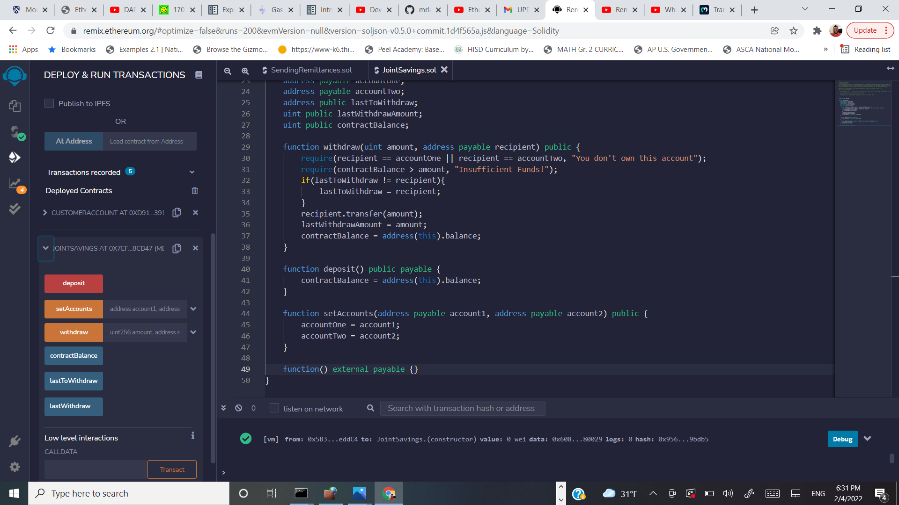
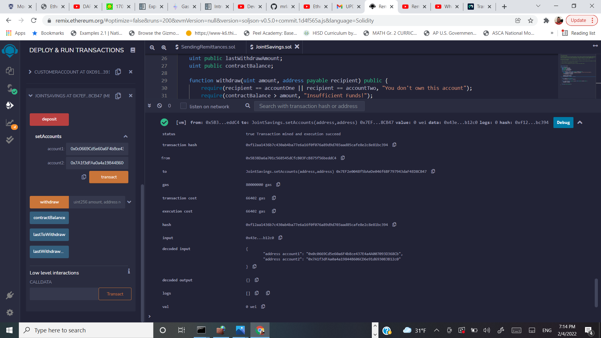
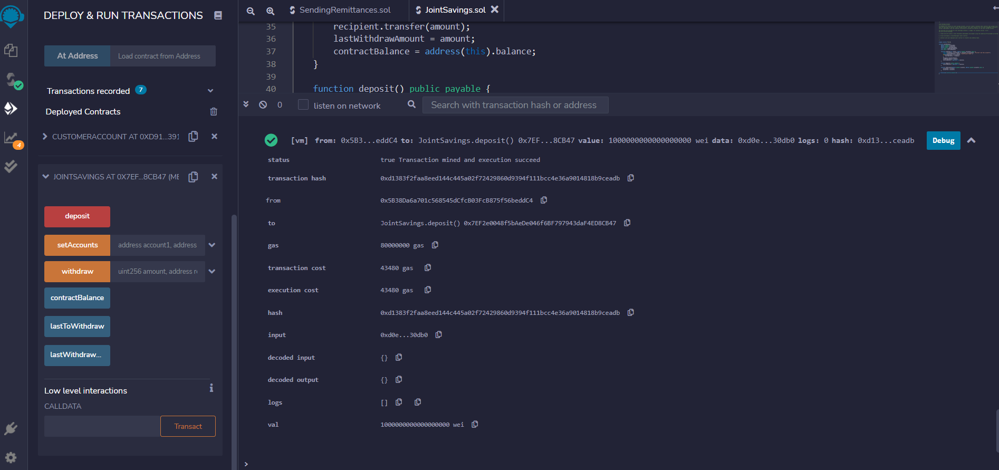
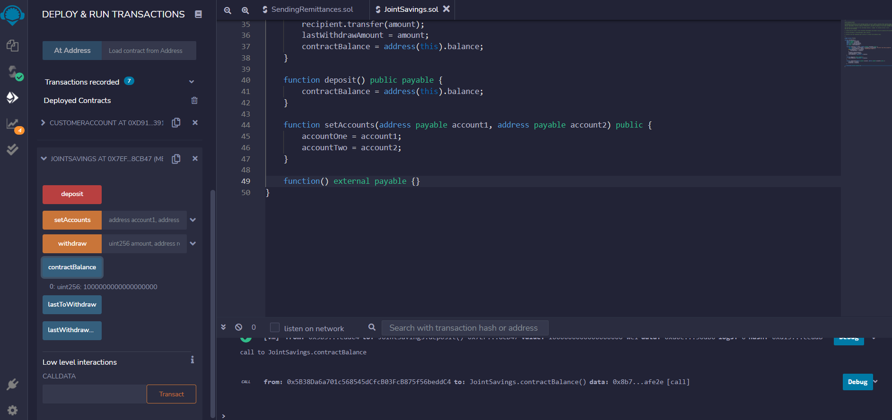
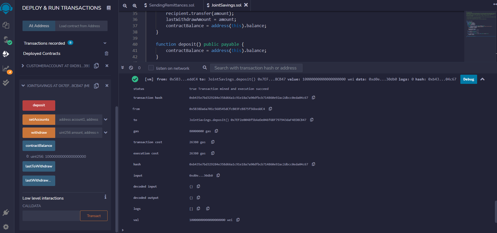
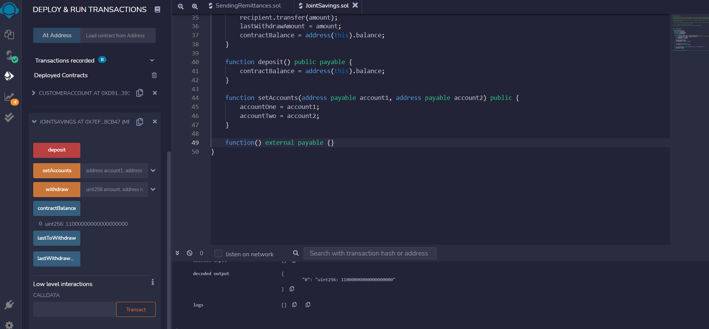
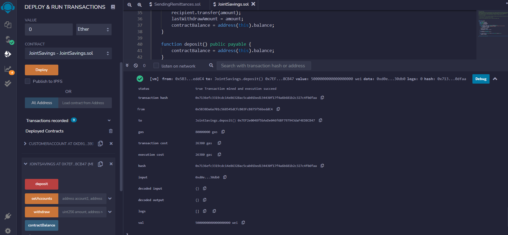
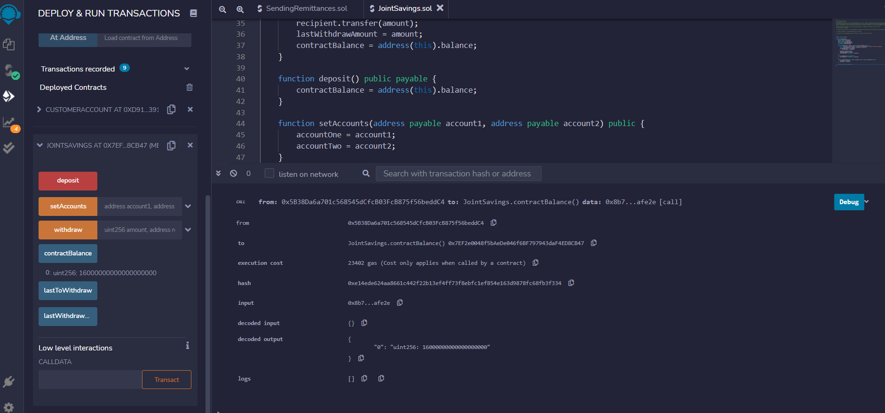

# Joint_Savings_Smart_Contract
Create a joint savings account via a smart contract in Solidity, deploy the contract, and interact with the functions to complete transactions.

---

## Technologies

This project leverages solidity 0.5.0 with the following packages:

We don't have any packages to use. The only platform we need for this program is the Remix IDE website. We'll be able to write and run our code from the Remix IDE without using any additional libraries or dependencies. 

---

## Installation Guide

As mentioned in our `Technologies` section above, we don't have any libraries or dependencies to install. We will use the Remix IDE to code, deploy, and interact with our Smart Contract. 
To use the Remix IDE, click on the link below:

**[Remix IDE](https://remix.ethereum.org/)**

---

## Usage

To use the 'Joint_Savings_Smart_Contract' application, simply clone the repository, open the file `joint_savings.sol` in the Remix IDE, and deploy via the Javascript Virtual Machine.

Once the contract is deployed, interact with the contract by using the sidebar. You will see the functions that we have created in our contract. 

Step 1: Deploy Contract\n
Once the Solidity Smart Contract is compiled, we have to deploy it in order to interact with it:

We can see in the preceding image that once the contract is deployed, you can verify its deployment in one of two ways. First, below the `Deploy` button, you will find a tab labeled `Deployed Contracts`. Once you click on this tab, you will see the smart contract you deployed, along with all of the interactive functions for that contract.\n 
Furthermore, we can see the successful deployment of the contract below our code, in what we call the `terminal` view. 

Great! Now that we have deployed our contract, let's start interacting with it. 

Step 2: Set Accounts\n
Use the `setAccounts` function, found in the interactive contract section in our sidebar, to assign adresses for both accounts in the `JointSavings` contract:

In the preceding image we can see the interaction taking place with our sidebar `setAccounts` function.\n
In the `terminal` view, we can see the successful transaction execution, along with the confirmation that the addresses have been assigned. 

Step 3: Deposit 1 Ether
Use the `deposit` function, found in the interactive section in our sidebar, to deposit 1 ether into the contract:

In the `Value` input box, type in 1 Ether, and then click on the `Deposit` function button. (You can also deposit as wei. The equivalent is 1000000000000000000 wei to 1 ether). Once the transaction is complete, you should receive a successful transaction message in the `terminal` view, along with the transaction information. 

Step 4: Contract Balance after first deposit\n
Use the `contractBalance` function, found in the interactive section of our contract, to verify the balance of the contract to ensure the deposit was successful:

In the preceding image, we can see that the contract balance is now 1000000000000000000 wei, which is equivalent to 1 ether.\n
Furthermore, you can see a successful transaction execution in the `terminal` view, along with the transaction details. 

Step 5: Deposit 10 Ether\n
Use the `deposit` function, found in the interactive section in our sidebar, to deposit 10 ether into the contract:

In the `Value` input box, type in 10 Ether, and then click on the `Deposit` function button. (You can also deposit as wei. The equivalent is 10000000000000000000 wei to 10 ether). Once the transaction is complete, you should receive a successful transaction message in the `terminal` view, along with the transaction information.

Step 6: Contract Balance after second deposit\n
Use the `contractBalance` function, found in the interactive section of our contract, to verify the balance of the contract to ensure the deposit was successful:

In the preceding image, we can see that the contract balance is now 11000000000000000000 wei, which is equivalent to 11 ether.\n
Furthermore, you can see a successful transaction execution in the `terminal` view, along with the transaction details.

Step 7: Deposit 5 Ether\n
Use the `deposit` function, found in the interactive section in our sidebar, to deposit 5 ether into the contract:

In the `Value` input box, type in 5 Ether, and then click on the `Deposit` function button. Once the transaction is complete, you should receive a successful transaction message in the `terminal` view, along with the transaction information.

Step 8: Contract Balance after third deposit\n
Use the `contractBalance` function, found in the interactive section of our contract, to verify the balance of the contract to ensure the deposit was successful:

In the preceding image, we can see that the contract balance is now 16000000000000000000 wei, which is equivalent to 16 ether.\n
Furthermore, you can see a successful transaction execution in the `terminal` view, along with the transaction details.

Great! Our `deposit` function is working like it should. 