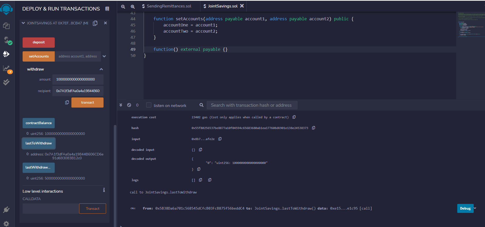

# Joint_Savings_Smart_Contract
Create a joint savings account via a smart contract in Solidity, deploy the contract, and interact with the functions to complete transactions.

---

## Technologies

This project leverages solidity 0.5.0 with the following packages:

We don't have any packages to use. The only platform we need for this program is the Remix IDE website. We'll be able to write and run our code from the Remix IDE without using any additional libraries or dependencies. 

---

## Installation Guide

As mentioned in our `Technologies` section above, we don't have any libraries or dependencies to install. We will use the Remix IDE to code, deploy, and interact with our Smart Contract. 
To use the Remix IDE, click on the link below:

**[Remix IDE](https://remix.ethereum.org/)**

---

## Usage

To use the 'Joint_Savings_Smart_Contract' application, simply clone the repository, open the file `joint_savings.sol` in the Remix IDE, and deploy via the Javascript Virtual Machine.

Once the contract is deployed, interact with the contract by using the sidebar. You will see the functions that we have created in our contract. 

Step 1: Deploy Contract 
Once the Solidity Smart Contract is compiled, we have to deploy it in order to interact with it:

We can see in the preceding image that once the contract is deployed, you can verify its deployment in one of two ways. First, below the `Deploy` button, you will find a tab labeled `Deployed Contracts`. Once you click on this tab, you will see the smart contract you deployed, along with all of the interactive functions for that contract. 
Furthermore, we can see the successful deployment of the contract below our code, in what we call the `terminal` view. 

Great! Now that we have deployed our contract, let's start interacting with it. 

Step 2: Set Accounts 
Use the `setAccounts` function, found in the interactive contract section in our sidebar, to assign adresses for both accounts in the `JointSavings` contract:

In the preceding image we can see the interaction taking place with our sidebar `setAccounts` function. 
In the `terminal` view, we can see the successful transaction execution, along with the confirmation that the addresses have been assigned. 

Step 3: Deposit 1 Ether 
Use the `deposit` function, found in the interactive section in our sidebar, to deposit 1 ether into the contract:

In the `Value` input box, type in 1 Ether, and then click on the `Deposit` function button. (You can also deposit as wei. The equivalent is 1000000000000000000 wei to 1 ether). 
Once the transaction is complete, you should receive a successful transaction message in the `terminal` view, along with the transaction information. 

Step 4: Contract Balance after first deposit 
Use the `contractBalance` function, found in the interactive section of our contract, to verify the balance of the contract to ensure the deposit was successful:

In the preceding image, we can see that the contract balance is now 1000000000000000000 wei, which is equivalent to 1 ether. 
Furthermore, you can see a successful transaction execution in the `terminal` view, along with the transaction details. 

Step 5: Deposit 10 Ether 
Use the `deposit` function, found in the interactive section in our sidebar, to deposit 10 ether into the contract:

In the `Value` input box, type in 10 Ether, and then click on the `Deposit` function button. (You can also deposit as wei. The equivalent is 10000000000000000000 wei to 10 ether). 
Once the transaction is complete, you should receive a successful transaction message in the `terminal` view, along with the transaction information.

Step 6: Contract Balance after second deposit 
Use the `contractBalance` function, found in the interactive section of our contract, to verify the balance of the contract to ensure the deposit was successful:

In the preceding image, we can see that the contract balance is now 11000000000000000000 wei, which is equivalent to 11 ether. 
Furthermore, you can see a successful transaction execution in the `terminal` view, along with the transaction details.

Step 7: Deposit 5 Ether 
Use the `deposit` function, found in the interactive section in our sidebar, to deposit 5 ether into the contract:

In the `Value` input box, type in 5 Ether, and then click on the `Deposit` function button.  Once the transaction is complete, you should receive a successful transaction message in the `terminal` view, along with the transaction information.

Step 8: Contract Balance after third deposit 
Use the `contractBalance` function, found in the interactive section of our contract, to verify the balance of the contract to ensure the deposit was successful:

In the preceding image, we can see that the contract balance is now 16000000000000000000 wei, which is equivalent to 16 ether. 
Furthermore, you can see a successful transaction execution in the `terminal` view, along with the transaction details.

Great! Our `deposit` function is working like it should. 

Step 9: Witdraw 5 Ether for account1 
Use the `withdraw` function, found in the interactive section of our smart contract, to send 5 ether to the address associated with account1:

In the preceding image, we can see the input areas for this `withdraw` function. You send 5000000000000000000 wei. (When it comes to withdraws, or remittances, we must send the currency in wei). We also identify the address where this transaction is going. 
Once the transaction is sent, you can verify its completion through the successfull message in the `terminal` view, along with the transaction details. 

Step 10: Contract Balance after first withdrawal 
Use the `contractBalance` function, found in the interactive section of our contract, to verify the balance of the contract to ensure the withdrawal was successful:

In the preceding image, we can see that the contract balance is now 11000000000000000000 wei, which is equivalent to 11 ether. 
Furthermore, you can see a successful transaction execution in the `terminal` view, along with the transaction details.

Step 11: Last to Withdraw after first withdrawal 
Use the `lastToWithdraw` function, found in the interactive section of our smart contract, to verify the last account to withdraw from the smart contract:

In the preceding image we can see that the last account to withdraw from the contract is the address ending in (...68Cb). 
You can verify this information through the sidebar, or the `terminal` view stating a successfull transaction. The last person to withdraw is, in fact, the last to person to whom we sent currency.

Step 12: Last Withdrawal Amount after first withdrawal 
Use the `lastWithdrawAmount` function, found in the interactive section of our smart contract, to verify that the last amount withdrawn matches the last amount sent to the specific address:

In the preceding image, we can see that under the `lastWithdrawAmount` function button, the value is 5000000000000000000. This means that we sent 5 ether to account1. 
We can also verify the withdraw by using the `terminal` view. Here you can see the value of the withdrawal, as well as the account who received the funds. 

Step 13: Witdraw 10 Ether for account2 
Use the `withdraw` function, found in the interactive section of our smart contract, to send 10 ether to the address associated with account2:

In the preceding image, we can see the input areas for this `withdraw` function. You send 10000000000000000000 wei. (When it comes to withdraws, or remittances, we must send the currency in wei). We also identify the address where this transaction is going. 
Once the transaction is sent, you can verify its completion through the successfull message in the `terminal` view, along with the transaction details. 

Step 14: Contract Balance after second withdrawal 
Use the `contractBalance` function, found in the interactive section of our contract, to verify the balance of the contract to ensure the withdrawal was successful:

In the preceding image, we can see that the contract balance is now 1000000000000000000 wei, which is equivalent to 1 ether. 
Furthermore, you can see a successful transaction execution in the `terminal` view, along with the transaction details.

Step 15: Last to Withdraw after second withdrawal 
Use the `lastToWithdraw` function, found in the interactive section of our smart contract, to verify the last account to withdraw from the smart contract:

In the preceding image we can see that the last account to withdraw from the contract is the address ending in (...12c0). 
You can verify this information through the sidebar, or the `terminal` view stating a successfull transaction. The last person to withdraw is, in fact, the last to person to whom we sent currency.

Step 16: Last Withdrawal Amount after second withdrawal 
Use the `lastWithdrawAmount` function, found in the interactive section of our smart contract, to verify that the last amount withdrawn matches the last amount sent to the specific address:

In the preceding image, we can see that under the `lastWithdrawAmount` function button, the value is 10000000000000000000. This means that we sent 10 ether to account2. 
We can also verify the withdraw by using the `terminal` view. Here you can see the value of the withdrawal, as well as the account who received the funds.

Great! It appears that our functions are doing exactly what we expect them to do. We are now able to fully interact with this `JointSavings` contract.

---

## Contributors

**Created by:** Tony Landero 
**Email:** mr.landero@gmail.com 

---

## License

MIT